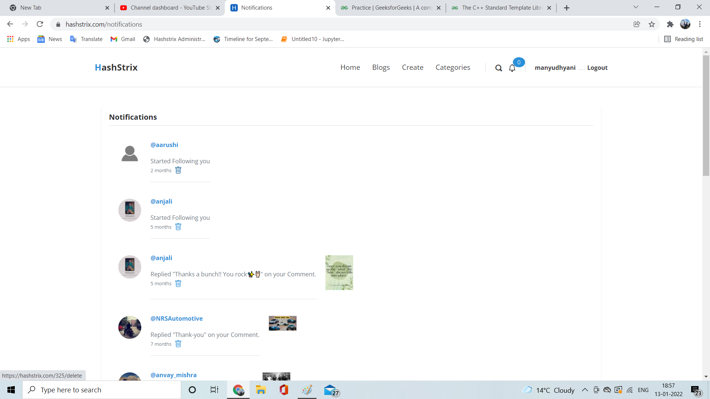

# HashStrix is a Social Media Website to create Blogs and follow other Bloggers to fabricate a Community.

The above image shows the Blogs page for the site. Here all the recommended blogs for the user comes with various other shortcuts to search blogs, accounts, filter blogs by following, latest blogs, trending categories and hashtags.

This is how a member's profile look like v/s Our own profile page below.
One can follow/unfollow people and see member's stats like total followers, views and blogs.

There are lots of setting option in which we can change our profile pic, user name, password, primary & secondary email IDs, delete account, and set bio, LinkedIn, YouTube, location,  and other useful Site links.

You can sign up for the site with google or facebook account or register from site registeration form. Authentuication Token and other security features like encryption for user's data is all taken care off.

A typical article page looks like the following image. If a user loged in have an article opened written by himself can see other options like update/ delete other than share article. Other users reading someone else article can only have an option to share and option to like the bottom.

The loged in user can comment on anyone's post with other options like reply to a comment (or thread), delete comment or view thread. User must be loged in to view someone's profile, follow/unfollow, comment or like a post. One can view any blog without logging in. 

There is a div showing similar articles/post when a particular post is opened. The similarity is calculated with number of tags common in both post. The heighest number of similar tags make two post most similar. Top 4-5 similar article are shown with each blogs if one have any. 

Reader can also see the trending categories and hashtags all the time.

The loged in user can get notification like user that followed him, commmented on his comment or article, and liked the post.

The create page for the article is as follow. User can give title, overview, main content, hashtags, category, and attach previous and next article card to the post. User can also decide to keep the post private or public. All private post can be only seen by the user on its account page.

Here's the footer for the site.

Here are some page to show that the site has mobile responsive pages. The pages below are blog, article and profile page respectively.

